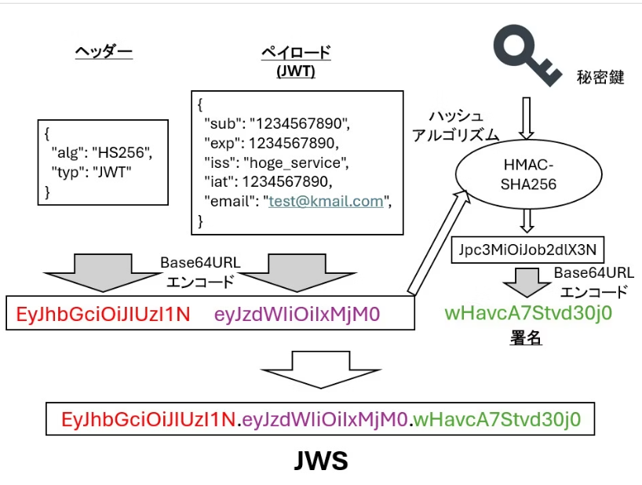
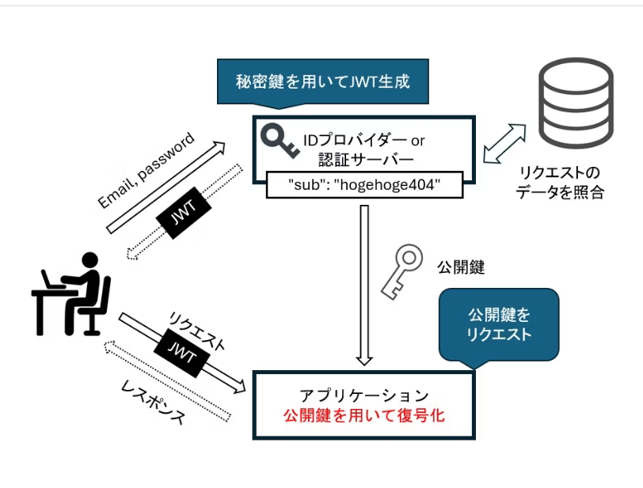

### [参照](https://qiita.com/Odatetsu/items/2326575f01a9a460ace4#%E3%83%98%E3%83%83%E3%83%80%E3%83%BC-header)


## JWTと JWS 
JWSとはJSON Web Signatureの略で、ヘッダーとペイロードと署名のJSON形式のデータをそれぞれBase64URLでエンコードして.で連結した文字列



JWS = ヘッダー ＋  ペイロード ＋  署名

###  ヘッダー
```sh
{
  "alg": "HS256",  # ハッシュアルゴリズム
  "typ": "JWT"     # トークンのタイプ
}
```

###  ペイロード
```sh
{
  "sub": "1234567890",       # ユーザ識別子。user_idといったユーザを識別するためのID
  "exp": 1234567890,         # JWTの有効期限
  "iss": "hoge_service",     # JWTの発行者
  "iat": 1234567890,         # JWTの発行日時
  "email": "test@kmail.com", # プライベートクレーム original
}
```

上記以外

- aud  :   JWTの受信者

- nbf  :   有効開始日時

- jti  :   JWTのID


### 署名
ヘッダーとペイロードを連結し、秘密鍵(secret)を使ってHMAC等のハッシュアルゴリズムで署名したもの。もしHeaderかPayloadのデータが改竄されていれば、JWT検証時に署名を用いて復号ができなくなるため、改竄を検知することができる。


###  サービス間での JWT 

-  認証サーバによって 秘密鍵を用いて 認証用のトークンが発行されて、その他は、公開鍵で解読して、上記ペイロードの情報をよみとり
サーバーが異なるマイクロサービスでも ユーザの識別とトークンの情報を共有できる





